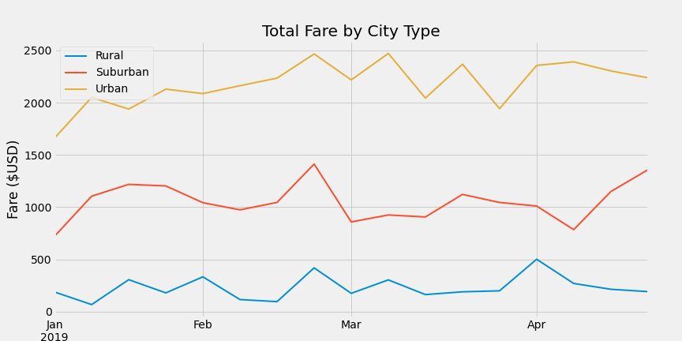

# Overview

The purpose of this analysis is to examine the ride sharing data and analyze the differences of the revenue generated across three different types of geographic locations:

* Urban
* Suburban
* Rural

# Analysis and Results

## Description of the Dataset

We are provided with two different datasets.
* **City data**: This data set contains names of cities, types (urban, suburban or rural) and the total driver count in each city. There are a total of 120 records in this data set.
* **Ride data**: This data contains actual rides taken with the timestamp, city in which the ride took place, and the fare collected for each ride. There are a total of 2375 records in this data set.

## Summary of Data by City Type

The table below summarizes various ride data metrics aggregated for the three types of geophraphic locations.

|   | Total Rides | Total Drivers	| Total Fare	| Average Fare per Ride	| Average Fare per Driver |
| - | ----------- | ------------- | ----------- | --------------------- | ----------------------- | 
| **Rural** | 125 | 78 | $4,327.93 | $34.62 | $55.49 |
| **Suburban** | 625 | 490 | $19,356.33 | $30.97 | $39.50 |
| **Urban** | 1625 | 2,405 | $39,854.38	| $24.53 | $16.57 |

* **Total Rides**: total rides are the most for urban cities and the least for rural towns.
* **Total Drivers**: total drivers are the most for urban cities and the least for rural towns.
* **Total Fare**: total fare collected is the most in urban cities and the least for rural towns. However, the total fare doesn't tell the whole story; we must normalize it to find the fare per ride and per driver.
* **Average Fare per Ride**: The average fare per ride is now flipped with rural towns netting the most fare per ride and urban cities netting the least. The most likely reason is that distances travelled in the rural areas are more than those in urban cities.
* **Average Fare per Driver**: The rural area driver collects the most fare, whereas the urban city driver collects the least.

## Plotting the Trend for the First Four Months of 2019

The graph below shows the trend of total fare for the first four months of 2019 for each of the three types of cities.

